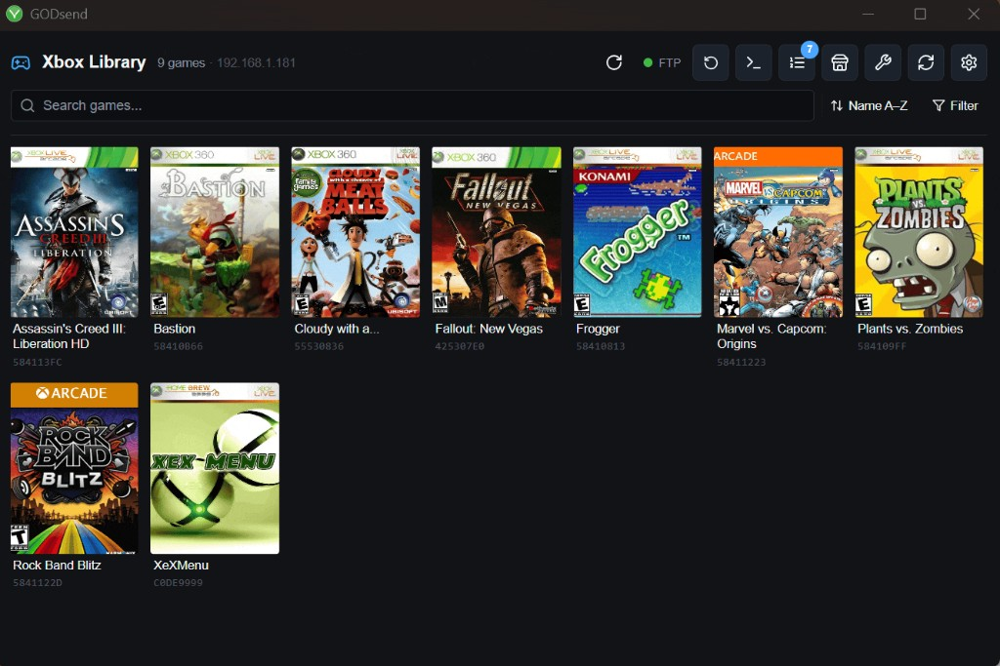

# GODsend 360

[](https://ko-fi.com/ghosty99)

**Repository:** [GitHub](https://github.com/ghostyshell/GODSend-360)

GODsend 360 is a local-network game management system for Xbox 360 consoles running the Aurora dashboard. It consists of three parts:

- **Go backend** — HTTP server on your computer (Windows, macOS, or Linux) that fetches games from Minerva Archive (via BitTorrent) or Internet Archive, converts ISOs to GOD format, and transfers them to the Xbox via FTP
- **Electron app** — Windows/macOS/Linux desktop tray application wrapping the backend with a live terminal and settings UI
- **Aurora Lua script** — runs on the Xbox and talks to the backend to browse, trigger downloads, and track progress

Download priority for online libraries: **Local Transfer folder → Minerva Archive → Internet Archive**. An Internet Archive account is only needed if Minerva doesn't have the title you want.

[](GODsend-360-2.9.2.mov)

[Download or play the overview video (`.mov`)](GODsend-360-2.9.2.mov)

---

## Table of Contents

- [Quick Installation](#quick-installation)
- [Running Without the Desktop App](#running-without-the-desktop-app)
- [Features](#features)
- [How it works](#how-it-works)
- [Building & repo structure](#building--repository-structure)
- [Setup options](#setup-options)
- [Configuration](#configuration)
- [Installing on the Xbox](#installing-on-the-xbox)
- [API, runtime folders & environment variables](#backend-http-api-runtime-folders--environment-variables)
- [Requirements](#requirements)
- [Additional documentation & troubleshooting](#additional-documentation--troubleshooting)

---

## Quick Installation

### 1. Download the installer

Download the build for your platform:

| Platform | GoFile | file.kiwi backup |
|---|---|---|
| **Windows (x64, installer — tray app + backend)** | [`godsend-Setup-2.12.14.exe`](https://gofile.io/d/X84yHn) | [`godsend-Setup-2.12.14.exe`](https://file.kiwi/c4b9656e#shXQi5rEFBFvqnjzHWMDyQ) |
| **Windows (x64, portable — no install needed)** | [`godsend-Portable-2.12.14.exe`](https://gofile.io/d/Ggolk6) | [`godsend-Portable-2.12.14.exe`](https://file.kiwi/6443112a#ebrHaO174BUno9qGim8u-Q) |
| **macOS (Apple Silicon)** | [`godsend-2.12.14-arm64.dmg`](https://gofile.io/d/ZWm7cN) | [`godsend-2.12.14-arm64.dmg`](https://file.kiwi/840e5265#xcXbN2Q8LBOcX1le44eqXA) |
| **macOS (Intel)** | [`godsend-2.12.14-x64.dmg`](https://gofile.io/d/B3piXG) | [`godsend-2.12.14-x64.dmg`](https://file.kiwi/ad481f1a#DtuyAFeJRWvwj_6o-p8CAw) |
| **Linux (x64 / amd64)** | [`godsend-2.12.14-x86_64.AppImage`](https://gofile.io/d/ke3zYL) | [`godsend-2.12.14-x86_64.AppImage`](https://file.kiwi/c73ee652#uM3ZZkiF_HdpAlUIeUDvnQ) |
| **Linux (arm64)** | [`godsend-2.12.14-arm64.AppImage`](https://gofile.io/d/P6sDj2) | [`godsend-2.12.14-arm64.AppImage`](https://file.kiwi/dbef90be#uAvMLPa0gjmdtiFa8x8cJw) |

> **Windows:** use **`godsend-Setup-X.X.X.exe`** for the full installer, or **`godsend-Portable-X.X.X.exe`** to run without installing. For the headless backend binary only, see [headless setup](docs/headless-setup.md).

### 2. Install and launch

1. **macOS:** open the `.dmg` and drag **GODsend** to Applications. **Linux:** `chmod +x` the `.AppImage` and run it. **Windows:** run **`godsend-Setup-2.12.2.exe`** and follow the installer (or just run **`godsend-Portable-2.12.2.exe`** directly — no install step needed).
2. **macOS / Linux / Windows:** launch **GODsend** from the Start menu, **Applications**, or your app launcher — the tray icon appears (on Linux it depends on your desktop environment). For a **headless backend** without the desktop app, see [headless setup](docs/headless-setup.md).

For Linux distro-specific run notes (Ubuntu/Debian/Fedora/Arch), see **Linux runtime notes** in the setup section below.

> **macOS first launch:** the app is not notarized with Apple, so Gatekeeper will block it the first time with *"Apple could not verify GODsend.app is free of malware"*. To allow it:
>
> 1. Click **Done** on the dialog (do **not** click "Move to Bin").
> 2. Open **System Settings → Privacy & Security** and scroll to the bottom.
> 3. You should see *"GODsend.app was blocked..."* — click **Open Anyway**.
> 4. Launch **GODsend** again and confirm at the prompt.
>
> You only need to do this once.

### 3. Configure download sources (optional)

Minerva Archive works out of the box with no account required — most games download immediately via BitTorrent.

If you want Internet Archive as a fallback (or for titles not on Minerva):

1. Click the tray icon and open the app window, then click the **⚙ Settings** button.
2. Under **Internet Archive account**, click **Log in** and enter your [archive.org](https://archive.org) credentials. Your session cookie is stored locally — your password is never saved.

You can also set a **Local Transfer folder** if you want to install from `.iso` files you already have on this machine.

### 4. Install Aurora scripts on the Xbox

The Aurora scripts are bundled with the installer. The easiest way to install them is via the app:

1. Enable Aurora's FTP server: **Aurora → Settings → Network → Enable FTP**.
2. In the GODsend app, open **⚙ Settings** → set **Backend server port** (if not using the default) and then scroll to **Xbox connection**.
3. Enter your **Xbox IP address** and click **FTP Aurora Scripts to Xbox**.
4. The scripts are uploaded to the path you set (default `Hdd1:\Aurora\User\Scripts\Utility\GODSend\`; on USB FTP often shows `Usb0:\Apps\Aurora\User\Scripts\Utility\GODSend\`), and `state.lua` is patched with your computer’s LAN IP + backend port.
5. Launch **GODsend** from Aurora → Scripts.

Alternatively, copy the `aurora-scripts/` folder to the Xbox manually via FTP, then edit `state.lua` to set `BRAIN_IP` and `PORT`. **Where to find it on disk:** Windows — under the install folder (e.g. `resources\aurora-scripts` next to the app); **macOS** — inside `GODsend.app` → **Show Package Contents** → `Contents/Resources/aurora-scripts`; **Linux (AppImage)** — `resources/aurora-scripts` inside the mounted or extracted image (see [Linux runtime notes](#linux-runtime-notes-different-distros)).

The Xbox will now connect to the backend on your computer. You can browse games, trigger downloads, and track progress directly from Aurora.

---

## Running Without the Desktop App

The Go backend works as a standalone headless server — no Electron, no GUI, no display required. Useful for always-on home servers, NAS boxes, Raspberry Pi, Docker, or any Windows / macOS / Linux host you want to run unattended.

Download a **platform-matched backend binary** from the table below (or a desktop AppImage/DMG if you prefer the full app), or build from source with Go 1.21+. Configure via environment variables, run the binary, and point your Xbox at it.

| Platform | GoFile | file.kiwi backup |
|---|---|---|
| **Windows (x64)** | [`godsend.exe`](https://gofile.io/d/5H41qW) | [`godsend.exe`](https://file.kiwi/91ab5dad#2svs_Ixop27RUk0WLpiSbg) |
| **macOS (Apple Silicon)** | [`godsend-darwin-arm64`](https://gofile.io/d/L01QNh) | [`godsend-darwin-arm64`](https://file.kiwi/4d5410d6#nPqL1F3BjhZU8K9kEgmI1w) |
| **macOS (Intel)** | [`godsend-darwin-amd64`](https://gofile.io/d/T1qWK0) | [`godsend-darwin-amd64`](https://file.kiwi/bd6c55aa#602e9xK1UCsHX47RbjD8WQ) |
| **macOS (universal, Electron helper)** | [`godsend-mac`](https://gofile.io/d/bCQT4g) | [`godsend-mac`](https://file.kiwi/2d584ac9#mtyjzxaqpOnx6tf391Iqjw) |
| **Linux (x64)** | [`godsend-linux-x64`](https://gofile.io/d/pdkvMI) | [`godsend-linux-x64`](https://file.kiwi/85dc2238#fjm0y9iGax0W7CaPoh_OrA) |
| **Linux (arm64)** | [`godsend-linux-arm64`](https://gofile.io/d/T99zO5) | [`godsend-linux-arm64`](https://file.kiwi/56209c15#N1f2AG6rr7Ol2hAXsYkSIQ) |

**[Full headless setup guide (build, configure, systemd/launchd service, Xbox pairing)](docs/headless-setup.md)**

---

## Features

Minerva Archive (BitTorrent, no account), Internet Archive (chunked parallel HTTP, optional), local ISOs, XBLA, DLC, XBLIG, Game Archives, Retro ROMs (62 systems via EdgeEmu), multi-disc support, GOD/XEX/content install layouts, FTP transfer with persistent retry, server queue management, and persistent logging.

The desktop app adds an **Xbox Library** (live view of games on your console with cover art, sorting, filtering, and move-to-drive), an **FTP Manager** (full file browser with cut/copy/paste/delete/rename/mkdir), an **Aurora Asset Editor** (search, preview, and upload cover/background/banner/icon artwork via RXEA or XboxUnity), **ISO to GOD and ISO to XEX** conversion tools, a **Job Queue** (unified game pipeline + FTP jobs), and **overlay navigation** so tools open as panels without leaving the current page.

**[Full feature list with details on each capability](docs/features.md)**

---

## How it works

```
[Xbox Aurora script] ──HTTP──▶ [Go backend on host] ──FTP──▶ [Xbox HDD/USB]
                                      │         ▲
                          ┌───────────┴──────┐  │
                    Minerva Archive     Internet Archive
                    (BitTorrent via     (chunked parallel HTTP,
                     aria2c)            optional account)
                          │
                   Local Transfer folder
                   (your own ISOs, highest priority)

[Electron desktop app] ──IPC──▶ [Go backend] ──FTP──▶ [Xbox]
  ├─ Xbox Library (browse games, covers, move between drives)
  ├─ FTP Manager (file browser, cut/copy/paste, upload)
  ├─ Aurora Asset Editor (RXEA decode/encode, artwork upload)
  ├─ ISO to GOD / ISO to XEX conversion tools
  └─ Job Queue (unified pipeline + FTP transfer tracking)
```

1. The Aurora script on the Xbox browses game libraries — lists are sourced from Minerva Archive or Internet Archive metadata
2. The user selects a title and a source; the script sends a trigger request to the Go backend
3. The backend checks for a local ISO first, then downloads from Minerva Archive via BitTorrent (no account needed) or falls back to Internet Archive (chunked parallel HTTP range requests, account required)
4. For disc ISOs the backend converts to Games on Demand format using a pure Go implementation; XBLA/digital titles are extracted natively — no external tools required
5. The finished game files are transferred to the Xbox over FTP using Aurora's built-in FTP server
6. The Aurora script polls the backend for status and shows a live progress display; the game appears in Aurora when the transfer completes

---

## Building & repository structure

Requires **Go 1.21+** and **Node.js 18+**. Quick start: `npm install && npm run build`. Backend only: `npm run build:server:all`.

**[Full build instructions, npm scripts, and repo layout](docs/building.md)**

---

## Setup options

You can run GODsend in two main ways:

- **Full desktop experience (recommended)** — Electron tray app + bundled backend. See [Quick Installation](#quick-installation) above.
- **Backend-only (headless)** — Run the Go server standalone on any machine with no GUI. See [Running Without the Desktop App](#running-without-the-desktop-app) above.

In both modes, the Aurora script setup is the same: copy `aurora-scripts/` to the Xbox, set `BRAIN_IP` and `PORT` in `state.lua` to the host and port where the backend listens, and enable Aurora’s FTP server.

### Linux runtime notes (different distros)

Use the AppImage that matches your CPU (`x64`/`amd64` or `arm64`):

```bash
chmod +x godsend-*.AppImage
./godsend-*.AppImage
```

If AppImage fails due to missing FUSE libraries, install distro-specific packages:

- **Ubuntu / Debian / Pop!_OS / Mint:** `sudo apt install libfuse2`
- **Fedora:** `sudo dnf install fuse fuse-libs`
- **Arch / EndeavourOS / Manjaro:** `sudo pacman -S fuse2`
- **openSUSE:** `sudo zypper install fuse libfuse2`

If your distro still blocks AppImage, extract and run without FUSE:

```bash
./godsend-*.AppImage --appimage-extract
./squashfs-root/AppRun
```

---

## Configuration

### Electron app settings

Open the settings page (⚙ button) to configure:

- **Launch at login** — registers GODsend with the OS login-item / startup list (Electron **Open at login** on macOS and Windows; Linux depends on the desktop environment)
- **Local Transfer folder** — directory the backend scans for pre-downloaded ISOs. If unset, defaults to **`runtime/Transfer`** under Electron’s **user data** directory — commonly **`%APPDATA%\GODsend\runtime\Transfer`** on Windows and **`~/Library/Application Support/GODsend/runtime/Transfer`** on macOS. On Linux the config folder name can vary; use **Open logs folder** on the home screen, then open the parent of **`logs/`** to find **`runtime/Transfer`**
- **Internet Archive account** — log in with your archive.org credentials; session cookies are stored locally, your password is never saved
- **Backend server port** — choose the backend listen port used by both Electron and Aurora script patching
- **Xbox connection** — enter your Xbox IP, FTP username, and password, then click **FTP Aurora Scripts to Xbox** to push the bundled Lua scripts directly to the console (requires Aurora's FTP server to be enabled); your computer’s LAN IP and selected backend port are detected/applied automatically
- **Server log files** — the app appends to a daily file under **`logs/`** next to the same user-data root (e.g. **`%APPDATA%\GODsend\logs\`** on Windows): timestamped backend stdout/stderr, session banner (paths, `GODSEND_*` env summary with secrets redacted, host IP), and notable UI actions (FTP upload steps, cache refresh, config changes). On the home screen use **Open logs folder** to reveal that directory in the system file manager

### Aurora script (`aurora-scripts/state.lua`)

The easiest way to configure and deploy the scripts is via **Settings → Backend server port** + **Xbox connection** in the app: set the backend port, enter the Xbox IP, and click **FTP Aurora Scripts to Xbox**. The app patches `BRAIN_IP` and `PORT` directly in `state.lua` before uploading.

To configure manually before copying to the Xbox:

```lua
BRAIN_IP = "192.168.1.x"   -- IP address of the computer running the backend
PORT     = "8080"          -- backend server port
```

If the host IP or port changes after installation, edit `state.lua` in the script directory via FTP and restart the script.

---

## Installing on the Xbox

**Via the app (recommended):**

1. Enable Aurora's FTP server: Aurora → Settings → Network → Enable FTP
2. In GODsend Settings → **Xbox connection**, enter the Xbox IP and click **FTP Aurora Scripts to Xbox**
3. Launch GODsend from Aurora → Scripts

**Manually:**

1. Copy all the contents of the `aurora-scripts/` folder (from the GODsend install directory or repo) to the Xbox at `HDD1:\Aurora\User\Scripts\Utility\GODSend\` (or the same path under your USB device if Aurora runs from USB, often including an `Apps` segment in FTP paths)
2. Edit `state.lua` — set `BRAIN_IP` and `PORT` to your computer’s backend host/port
3. Enable Aurora's FTP server: Aurora → Settings → Network → Enable FTP
4. Launch GODsend from Aurora → Scripts

---

## Backend HTTP API, runtime folders & environment variables

The backend listens on port `8080` by default. Key endpoints: `/browse`, `/trigger`, `/status`, `/queue`, `/register`, `/files/`, `/cache-status`, `/cache-refresh`, `/tools/probe-iso`, `/tools/iso2god`, `/tools/iso2xex`, `/rxea/decode`, `/rxea/encode`, and 17 FTP endpoints under `/ftp/*` (ping, list, mkdir, delete, rename, batch, upload, copy, move-game, jobs, and more).

**[Full API reference, runtime folder layout, and environment variable table](docs/api-reference.md)**

---

## Requirements

- **Desktop app:** 64‑bit **Windows 10/11**, **macOS** (Intel or Apple Silicon), or **64‑bit Linux** (x64 or arm64 AppImage). **Headless backend only:** same platforms plus any OS the Go toolchain targets — see [headless setup](docs/headless-setup.md).
- At least **500MB** free for the app, plus **15–25GB** recommended for temp + ready game data
- Xbox 360 running Aurora (or another compatible dashboard) with FTP server enabled
- Computer and Xbox on the same local network
- Free archive.org account only if you use **Internet Archive** as a source (Minerva Archive needs no account)

---

## Additional documentation & troubleshooting

### Legacy Windows installer docs
Older Windows installers and guides (for example, “GODSend Homelab Edition – Windows Installation Guide”) are still useful as historical context and screenshots.

- A summary of how the legacy layout maps to this repo lives in [`docs/legacy/legacy-installers-and-layout.md`](docs/legacy/legacy-installers-and-layout.md).
- The full legacy Windows walkthrough (formerly a PDF) is in [`docs/legacy/godsend-windows-install-guide.md`](docs/legacy/godsend-windows-install-guide.md).

Legacy external references (historical, no longer updated):

- Original repo (legacy): `https://gitgud.io/Nesquin/godsend-homelab-edition`
- Legacy Windows installer repo: `https://github.com/my573ry/GODSendEXE/releases`
- Legacy GitGud releases: `https://gitgud.io/Nesquin/godsend-homelab-edition/-/releases`

### Common issues (quick checklist)

- **Lua script not visible in Aurora**
  - Verify path: `Hdd1:\Aurora\User\Scripts\Utility\godsend\`
  - Ensure `main.lua`, `state.lua`, `menu_system.lua`, and `Icon/` are all present.
  - Restart Aurora.

- **Xbox cannot reach backend**
  - Confirm the backend is listening on `http://<computer-ip>:<port>` (open in a browser on the same machine).
  - Make sure `BRAIN_IP` / `PORT` in `state.lua` on the Xbox match your computer’s backend host/port.
  - Confirm the computer’s firewall allows inbound connections on the configured backend port.
  - Ensure the computer and Xbox are on the same subnet.

- **FTP transfer problems**
  - **Desktop app:** open **⚙ Settings → Xbox connection**, expand **FTP Debugging Tools**, and click **Save connection** first so the IP and credentials match Aurora. Click **Test Connection** — you should see a successful login, `PWD`, and a root directory listing in the debug console; if it fails, read the verbose FTP log for the exact error (wrong IP, bad password, FTP disabled, or path issues).
  - Use **Scan Network Ports** with your LAN subnet (e.g. `192.168.1`) if you are not sure which host is the Xbox; it probes port **21** on `.1`–`.254`.
  - Enable FTP in Aurora: **Aurora → Settings → Network → Enable FTP**, and confirm username/password match what you saved in GODsend.
  - As a cross-check, use an external FTP client (e.g. FileZilla, WinSCP, Cyberduck) to connect to the Xbox on port **21**.
  - Check router/firewall rules that might block FTP between the computer and the Xbox.

- **Conversions/downloads fail or “Ready” is empty**
  - Verify there is enough free disk space (at least 2–3× the ISO size).
  - Check backend output: the Electron log view, **Open logs folder** daily log file, or your terminal if running headless — look for Minerva / Internet Archive errors.
  - If using your own ISOs, ensure they are in the Transfer folder and the backend is configured for local mode.

For deeper background on how earlier installers worked (and additional screenshots and FAQs), consult the legacy PDF guide or the legacy documentation linked above.
